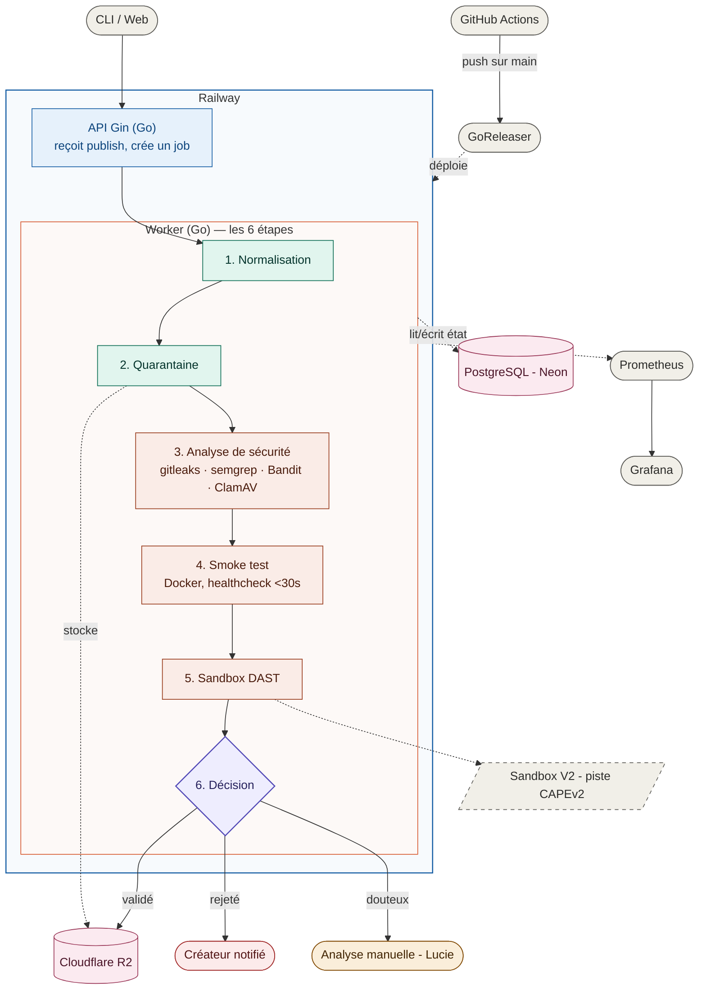

# Architecture — pipeline de sécurité ODIN

```mermaid
%%{init: {'flowchart': {'curve': 'basis'}}}%%
flowchart TB
    CLI([CLI / Web])
    GHA([GitHub Actions])
    GR([GoReleaser])
    PROM([Prometheus])
    GRAF([Grafana])
    NEON[(PostgreSQL - Neon)]
    R2[(Cloudflare R2)]
    SANDBOXTOOL[/Sandbox V2 - piste CAPEv2/]
    NOTIF([Créateur notifié])
    MANUAL([Analyse manuelle - Lucie])

    GHA -->|push sur main| GR

    subgraph Railway["Railway"]
        API["API Gin (Go)<br/>reçoit publish, crée un job"]

        subgraph WORKER["Worker (Go) — les 6 étapes"]
            S1[1. Normalisation]
            S2[2. Quarantaine]
            S3["3. Analyse de sécurité<br/>gitleaks · semgrep · Bandit · ClamAV"]
            S4["4. Smoke test<br/>Docker, healthcheck &lt;30s"]
            S5[5. Sandbox DAST]
            S6{6. Décision}

            S1 --> S2 --> S3 --> S4 --> S5 --> S6
        end

        API --> S1
    end

    CLI --> API
    GR -. déploie .-> Railway
    Railway -. scrape métriques .-> PROM
    PROM --> GRAF

    S2 -. stocke .-> R2
    WORKER -. lit/écrit état .-> NEON
    S5 -.-> SANDBOXTOOL

    S6 -->|validé| R2
    S6 -->|rejeté| NOTIF
    S6 -->|douteux| MANUAL

    classDef entry fill:#F1EFE8,stroke:#5F5E5A,color:#2C2C2A,stroke-width:1px
    classDef prep fill:#E1F5EE,stroke:#0F6E56,color:#04342C,stroke-width:1px
    classDef scan fill:#FAECE7,stroke:#993C1D,color:#4A1B0C,stroke-width:1px
    classDef decision fill:#EEEDFE,stroke:#534AB7,color:#26215C,stroke-width:1.5px
    classDef success fill:#EAF3DE,stroke:#3B6D11,color:#173404,stroke-width:1px
    classDef danger fill:#FCEBEB,stroke:#A32D2D,color:#501313,stroke-width:1px
    classDef warn fill:#FAEEDA,stroke:#854F0B,color:#412402,stroke-width:1px
    classDef store fill:#FBEAF0,stroke:#993556,color:#4B1528,stroke-width:1px
    classDef sandbox fill:#F1EFE8,stroke:#5F5E5A,color:#2C2C2A,stroke-dasharray: 5 5
    classDef api fill:#E6F1FB,stroke:#185FA5,color:#0C447C,stroke-width:1px

    class API api
    class CLI,GHA,GR,PROM,GRAF entry
    class S1,S2 prep
    class S3,S4,S5 scan
    class S6 decision
    class NEON,R2 store
    class NOTIF danger
    class MANUAL warn
    class SANDBOXTOOL sandbox

    style Railway fill:#F7FAFD,stroke:#185FA5,stroke-width:1.5px
    style WORKER fill:#FDF9F7,stroke:#D85A30,stroke-width:1px
```
